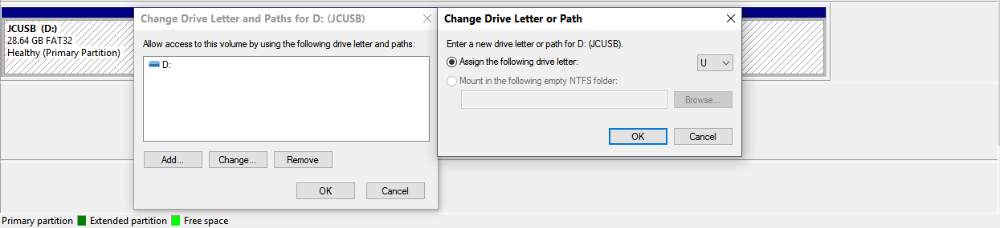
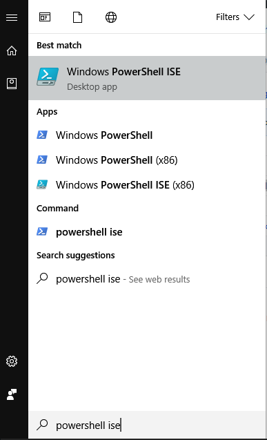
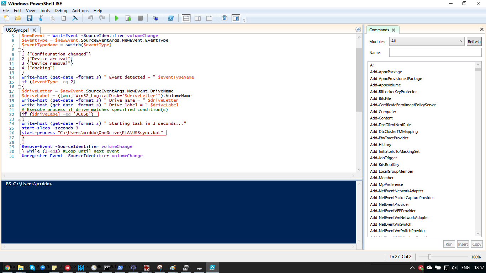
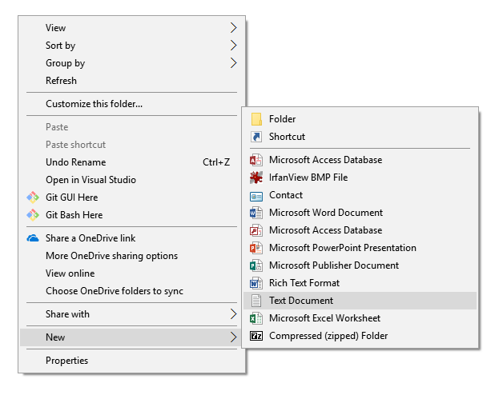
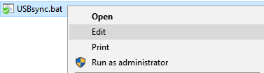

_Friendly reminder: Whilst I may try to help you / improve these tips, I'm not responsible for anything breaking ;)_

## Automated backup of USB contents to PC folder (then cloud, if you like) - Windows PCs, free
I work on a few different computers for my lesson plans, PPTs, handouts, etc. - and I want to be sure that I have a backup of this stuff (as you'll see in another tip, I almost lost several PPTs when my USB got bent).

**Summary:**
At logon, a batch (.bat) script will run which makes a Windows Powershell script run. This Powershell script detects USB insertion and removal, and makes a .bat script run on USB insertion. This second .bat script uses Robocopy (built into Windows) to copy files which are newer on the USB stick than in the PC's folder.
Note: USB detection can be specific to USB-drive letter, and/or name (so, if you name your USB drive you want to backup, only this USB will be backed up!).
Note: You can customise the RoboCopy rules with EasyRoboCopy. E.g.
1. Mirror USB contents (if you work on the PC folder's files, they'll be overwritten by the older USB files). _I haven't gone for this default in this guide!_
2. Ignore files above a certain size
3. _aaaaand much much more_

**Prerequisites:**
1. Rename USB (e.g. JCUSB)

- Go to My Computer/This PC
- Right click the USB drive, and hit "Properties"
- Type whatever you like into the bar at the top, then hit Apply. _Using your name/initials may help people send a USB stick your way, in case you lose it!_
2. _Optional:_ Change USB's letter (really not neccesary, but maybe you like to customise things for the fun of it;))

- Search Windows for "Disk Management", and click "Create and format hard **disk** partitons."

- Right click your USB drive, and press "Change drive letter and paths".
- Select the USB drive, hit "change", and assign the letter U.

**Main process:**
Now, you will need to customise this code for your 1) your USB drive, and 2) your PC's cloud-sync folder. Bits that need changing are highlighted (in red boxes in the image, with #1 and #2 in the code) - more info below! Do this inside _Windows Powershell ISE_.



```#Requires -version 2.0
Register-WmiEvent -Class win32_VolumeChangeEvent -SourceIdentifier volumeChange
write-host (get-date -format s) " Beginning script..."
do{
$newEvent = Wait-Event -SourceIdentifier volumeChange
$eventType = $newEvent.SourceEventArgs.NewEvent.EventType
$eventTypeName = switch($eventType)
{
1 {"Configuration changed"}
2 {"Device arrival"}
3 {"Device removal"}
4 {"docking"}
}
write-host (get-date -format s) " Event detected = " $eventTypeName
if ($eventType -eq 2)
{
$driveLetter = $newEvent.SourceEventArgs.NewEvent.DriveName
$driveLabel = ([wmi]"Win32_LogicalDisk='$driveLetter'").VolumeName
write-host (get-date -format s) " Drive name = " $driveLetter
write-host (get-date -format s) " Drive label = " $driveLabel
`#Execute process if drive matches specified condition(s)`
if ($driveLetter -eq 'Z:' -and $driveLabel -eq 'Mirror')       #1
{
write-host (get-date -format s) " Starting task in 3 seconds..."
start-sleep -seconds 3
start-process "Z:\sync.bat"    #2
}
}
Remove-Event -SourceIdentifier volumeChange
} while (1-eq1) #Loop until next event
Unregister-Event -SourceIdentifier volumeChange
```

- Note at **#1** You can have simply 
```**if ($driveLabel -eq 'YOUR_USB_NAME') #1**```,
where you replace **YOUR_USB_NAME** with ... you guessed it, your USB's name.
- Note at **#2** You should give the location and name of a _.bat_ file - we will create this later. I'd recommend having this be synched to the cloud, just so you have a backup. For me, I have: 
```start-process "C:\Users\middo\OneDrive\ELA\USBsync.bat"```

- Save this as a .ps1 file in your cloud-sync folder (C:\Users\middo\OneDrive\ELA). I went for the name _USBsync.ps1_.
- Create a .bat file in the same cloud-sync folder (C:\Users\middo\OneDrive\ELA):


- Open the .bat file for editing:

- Copy-paste the code from EasyRoboCopy into the .bat file. If you want to check (and copy) any updates every 1 minute(s), you can use: ```start /min ROBOCOPY.EXE "U:\ELA Lessons" "C:\Users\middo\OneDrive\ELA\ELA Lessons" /E /DCOPY:DAT /MOT:1 /PF /XO /R:2 /W:3 /MT```
Note: you can change _/MOT:1_ to /MOT:M, where M is the update interval in minutes.
- If you only want to copy updated USB contents on USB insertion, use this code:
```aaa```
- **Please make sure that (your version of) `"U:\ELA Lessons"` is the USB folder you would like to copy from. Likewise, make sure that `"C:\Users\middo\OneDrive\ELA\ELA Lessons"` is the cloud-sync folder you'd like to paste USB contents to.**

TODO 
shell:startup
.bat file
code

6. In Task Scheduler, create a task:
- [Trigger] = Log on of user 
- [Action] = Start a program, 
- Program/script = `powershell`
- Add arguments (optional) `C:\Users\middo\OneDrive\ELA\USBSync.ps1`


If you want to customise some settings/rules for USB copying:
Get EasyRoboCopy from http://www.tribblesoft.com/home-page/easy-robocopy/easyrobocopy-v1-0-14/; EasyRoboCopy provides an interface for RoboCopy (command line, built into Windows). Here's an annotated image to help you navigate some interesting areas:


1. Your USB source
2. Your destination source (make sure your cloud sync program knows to upload this folder).
3. Copy all subdirectories (not just everything in the "home" folder of the USB), even if they're empty.
4. Try again if there's a problem.
5. If a file on the USB is older than the "same" file in the cloud-sync folder, don't replace the cloud-sync version.
6. Make things run a bit faster.
7. You could set the maximum bytes to 10000000 (10,000,000 = 10MB) - but you'll big videos, some songs, some PPPTs etc. this way.
8. Make the program check for updates every (1) minute, and copy if there's an update.
9. Start copying.

Credit:
https://superuser.com/a/845411/485752 - (USB detection powershell script)

## The dangers of sliding whiteboards
One of my schools has a smart TV (great!) with front-facing USB ports. I have my USB stick attached to my keys, and the extra little distance meant that caused a board to snag when I slide it towards the screen. My USB stick got bent and didn't work - so I hit it with a screwdriver base until it'd fit in a USB slot; fortunately, it still worked (despite every computer claiming there's an error when I plug it in!).

Tips: 
*keep USB sticks separate from keychains (though that makes them easy to lose), 
*remove them from the smart screen once your PPT has loaded. To make up for potentially having to reinsert your USB in a class, you can make shortcuts to your relevant lessons in the main directory of the USB - so you have fast access to your PPTs (whilst maintaining your file structure of choice).
*some smart TVs may have USB extension/adapter devices at the side/back. Use them if you can!

### Todo: Don't forget to register to vote 
https://www.gov.uk/register-to-vote 

"British citizens living abroad
You can register as an overseas voter for up to 15 years after leaving the UK, as long as:

-you’re a British citizen
-you were registered to vote in the UK within the previous 15 years (or, in some cases, if you were too young to have registered when you left the UK)
Just register to vote in the normal way. You’ll need to renew your registration every year."
 from https://www.gov.uk/voting-when-abroad

### Todo: Student Finance England (SFE) - student loan repayments 
http://www.studentloanrepayment.co.uk/portal/page?_pageid=93,6678653&_dad=portal&_schema=PORTAL
n.b. if this link doesn't work, search for "student finance england abroad"


### Todo: Essential Chinese for the classroom (for lower grades)

### Todo: Checking mobile data usage on China Unicom

### Todo: WeChat location sharing to meet up with your friends


Markdown is a lightweight and easy-to-use syntax for styling your writing. It includes conventions for

```markdown
Syntax highlighted code block

# Header 1
## Header 2
### Header 3

- Bulleted
- List

1. Numbered
2. List

**Bold** and _Italic_ and `Code` text

[Link](url) and 
```

For more details see [GitHub Flavored Markdown](https://guides.github.com/features/mastering-markdown/).

### Jekyll Themes

Your Pages site will use the layout and styles from the Jekyll theme you have selected in your [repository settings](https://github.com/IdiosApps/ShanghaiTeacherTips/settings). The name of this theme is saved in the Jekyll `_config.yml` configuration file.

### Support or Contact

Having trouble with Pages? Check out our [documentation](https://help.github.com/categories/github-pages-basics/) or [contact support](https://github.com/contact) and we’ll help you sort it out.
